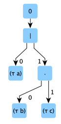

# An OBP2 LanguageModule for RegularExpressions


## Purpose

The *LRegExp* runtime gives an SLI view over a regular expression.

## Syntax

The syntax is a simplified version defined as follows:

```scala
RegExp<T> 
   = Terminal
      = "∅" Empty
      | "ϵ" Epsilon
      | "τ" Token          (o: T)
   | Composite 
      = "|" Union          (lhs rhs: RegExp<T>)          
      | "∘" Concatenation  (lhs rhs: RegExp<T>)
      | "*" KleeneStar     (operand: RegExp<T>)
```

For example: 
```regexp
a|bc
```
parses to:



## Derivatives

```scala
D ∅         t ≜ ∅
D ϵ         t ≜ ∅
D (τ o)     o ≜ ϵ
D (τ o)     t ≜ ∅, where o ≠ c
D (L₁ | L₂) t ≜ (D L₁ t) | (D L₂ t)
D (L₁ ∘ L₂) t ≜ (D L₁ t) ∘ L₂ | (Δ L₁) ∘ (D L₂ t)
D (L₁*)     t ≜ (D L₁ t) ∘ (L₁*)
```